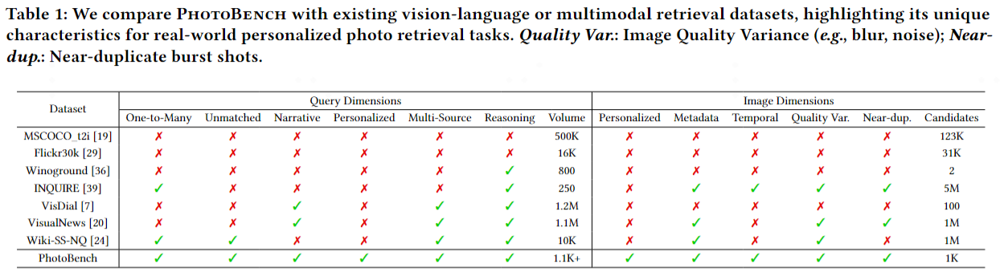
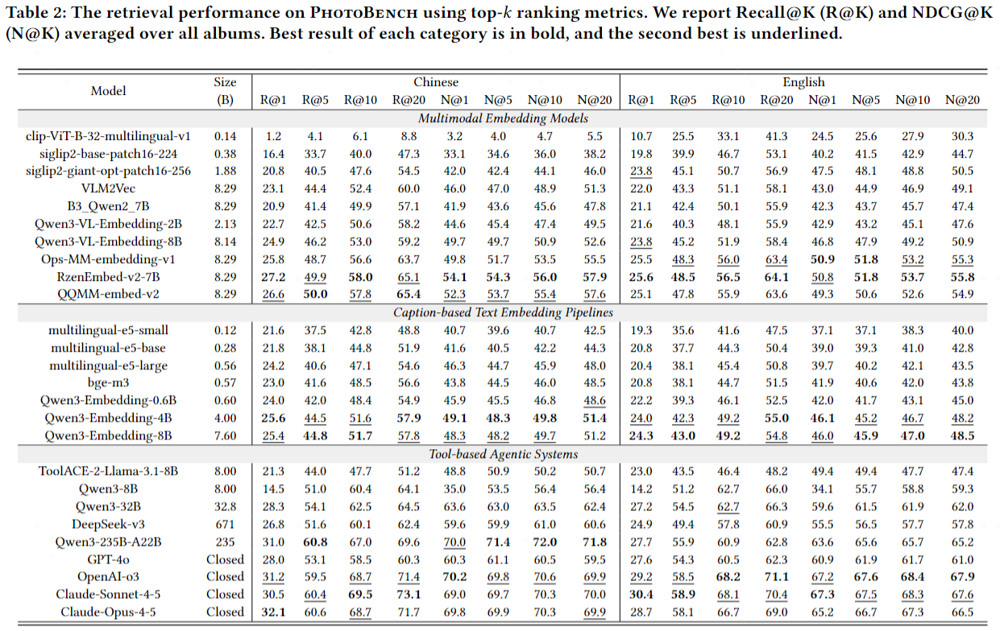

# PhotoBench (中文)

这里是 PhotoBench 的官方仓库，这是一个为照片检索与推理设计的全新评测基准。本仓库为研究人员提供了必要的数据集和工具，以便在真实的相册场景中评估其模型的性能。

考虑到个人相册的私密性，并为了保护照片中人物的隐私，我们将数据集分为两部分提供：一个用于定性评估的小型可视化样本集，以及一个用于量化评估的、经过特征提取的脱敏数据集。

## 数据集设计

为了解决现有数据集的局限性，我们引入了 PhotoBench，它专为真实世界的相册检索和推理而设计。与以前的文本到图像评测基准相比，其主要区别总结如下：



PhotoBench 将隐私保护作为首要设计原则。我们不直接提供完整的图片数据集，而是提供：

1.  **一个小的样本集 (`dataset/samples/`)**: 每个相册包含几十张图片和查询。这个子集可以让您对数据集的特性进行定性分析和直观了解。
2.  **用于评测的脱敏数据 (`dataset/protected/`)**: 对于完整的数据集，我们提供了提取出的、隐私安全的数据特征。这些特征涵盖了我们论文主表中提到的所有模型，方便您复现我们的实验结果。这包括：
    *   图像和文本的嵌入索引。
    *   匿名化处理后的人脸信息。
    *   位置和时间的元数据。

这样的设计让您可以在本地使用这些特征来运行您的检索模型，并生成提交文件。

## 评测结果

下表总结了各种模型在 PhotoBench 评测基准上的性能。这提供了当前最先进技术的概览以及仍然存在的挑战。



## 复现我们的结果

您可以通过运行我们提供的评测脚本来复现论文中的结果。这些脚本会利用 `dataset/protected/` 目录中预先计算好的特征，来生成一个符合格式要求的提交文件。

### 基于 Caption 的检索

要运行基于 Caption 的模型评测，您需要提供一个 sentence-transformer 模型的路径。

**命令示例:**
```bash
python scripts/caption/eval_caption.py \
    --model_path /path/to/your/sentence-transformer-model \
    --index_dir dataset/protected/album1/images/captions/bge-m3 \
    --query_file dataset/samples/album1/query.json \
    --language cn
```
该命令将在 `results/cn/` 目录下生成一个 `_submission.json` 文件。

### 基于 Embedding 的检索

要运行基于图像 Embedding 的模型评测，您需要提供模型的架构名称和其检查点文件的路径。

**命令示例:**
```bash
python scripts/embedding/eval_embedding.py \
    --model_name "ops_mm_embedding_v1" \
    --model_path /path/to/your/model_checkpoint.pth \
    --index_dir dataset/protected/album1/images/embeddings/chinese-clip-vit-base-patch16 \
    --query_file dataset/samples/album1/query.json \
    --language cn
```
该命令同样会在 `results/cn/` 目录下生成一个 `_submission.json` 文件。

## 评测与提交

当您生成了提交文件后——无论是通过运行我们上面展示的评测脚本，还是使用您自己的 Agent——您都可以将其提交到我们的在线平台以获得最终分数。

**评测网址:** [https://photo-bench-site.vercel.app](https://photo-bench-site.vercel.app) 
**国内访问网址：** [https://sorrowcloud.tech](https://sorrowcloud.tech)

评测流程如下:

1.  **生成提交文件**: 运行脚本以产出 `_submission.json` 文件。
2.  **提交您的文件**: 将生成的 JSON 文件上传到我们的评测网站。
3.  **接收分数**: 评测结果将会发送到您在网站上提供的邮箱地址。

### 提交文件格式

所有评测脚本都会生成以下结构的文件。如果您使用自定义的提交方式，请确保文件格式保持一致：

```json
{
  "model_name": "<your_model_name>",
  "language": "cn" or "en",
  "results": [
    { "query_id": "<query_id>", "predictions": ["<filename_1>", "<filename_2>", ...] }
  ]
}
```

## 仓库结构

-   `dataset/samples/`: 每个相册的一小部分可视化样本 (例如，20个查询及其对应的图片)。
-   `dataset/protected/`: 用于本地评测的脱敏特征 (Caption/Embedding索引、位置/时间元数据、匿名化人脸信息)。
-   `scripts/`: 用于生成提交文件的评测脚本。
    -   `eval_embedding.py`: 用于基于 Embedding 的检索。
    -   `eval_caption.py`: 用于基于 Caption 索引的检索。
    -   `eval_agent.py`: 用于基于 Agent 的检索流水线。
